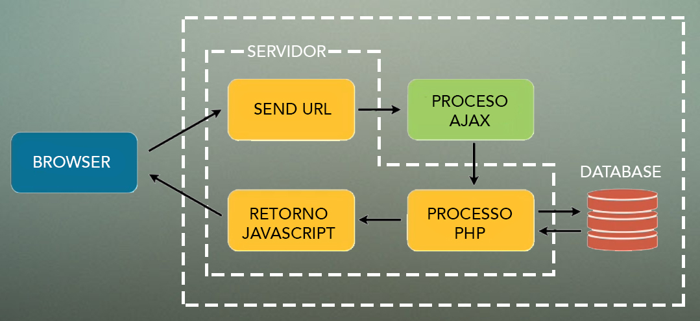

# Wiser-Educacao (Encurtador de URL)

<b>- index.php</b>
  
Ao enviar os conteúdos contido nos <b>INPUTs</b>, o <b>AJAX</b> processa o dado e envia para o <b>PHP</b> ecurtar a URL.	
  

  <b>- EncurtaURL.php</b>			
  
O <b>PHP</b> criar uma chave única usando a função <b>GeraURL()</b> verificando antes de este encurtamento gerado não existe na base com o <b>verificaChave()</b>.
   Caso não exista ele faz a gravação na base usando o <b>save_db()</b>.

  <b>- js.php</b>			
   Este <b>JS</b> verifica a chamada do form com a função <b>submitform()</b> e repassando para o AJAX as informações via <b>POST</b>.							
   Este arquivo também faz a validação do preenchimento e máscara dos campos utilizando <b>dateInputMask()</b> e <b>HoraInputMask()</b>.
  
	

  

  <b>- Desencurta.php</b>			
   Ao receber a variável via <b>POST</b> este arquivo consulta no banco a validade da URL e caso esteja vencido retorna com uma mensagem, caso esteja dentro prazo ele redireciona para o URL de ORIGEM.							
  

  <b>- conn_db.php</b>			
   Arquivo de conexão principal utilizando <b>mysqli_connect</b>.
  
	
